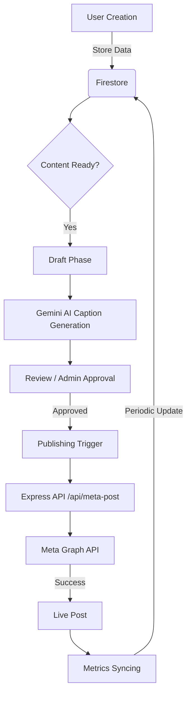

# Marketing Content Planner

A comprehensive social media content tracker with AI-powered caption generation and deliverable management. This application helps marketing teams plan, create, and publish content across various social platforms while tracking engagement metrics in real-time.

## 🚀 Key Features

- **Multi-View Project Tracking:** View content in List, Kanban, or Monthly Table formats.
- **AI-Powered Content Creation:** Generate professional captions and visual ideas using Google's Gemini AI.
- **Direct Meta Integration:** Publish and schedule posts directly to Facebook Pages and Instagram Business accounts.
- **Social Media Hub:** Track real-time metrics (reactions, comments, shares) for published content.
- **Governance & Approvals:** Roles-based access control with supervisor approval workflows for deletions and sensitive actions.
- **Media Management:** integrated file uploads and previewing for social media deliverables.

## 🛠️ Tech Stack

- **Frontend:** React 19, Vite, Tailwind CSS, Framer Motion, Lucide React.
- **Backend:** Node.js (Express), `tsx`.
- **Database & Auth:** Firebase Firestore, Firebase Storage, Firebase Authentication.
- **AI Engine:** Google Gemini AI (@google/genai).
- **APIs:** Meta Graph API (Facebook & Instagram).

## 📋 Setup & Installation

### Prerequisites

- Node.js (v18+)
- A Firebase Project
- Google AI Studio API Key (for Gemini)
- Meta Business Account with Page Access Token (for Facebook/Instagram integration)

### Configuration

1. **Clone the repository:**
   ```bash
   git clone <repository-url>
   cd marketing-content-planner
   ```

2. **Install dependencies:**
   ```bash
   npm install
   ```

3. **Environment Variables:**
   Create a `.env` file in the root directory and configure the following:
   ```env
   # Google Gemini API
   GEMINI_API_KEY=your_gemini_api_key

   # Meta / Facebook Integration
   FACEBOOK_PAGE_ACCESS_TOKEN=your_page_access_token
   FACEBOOK_PAGE_ID=your_page_id

   # Firebase Configuration (Exposed to Client)
   VITE_FIREBASE_API_KEY=...
   VITE_FIREBASE_AUTH_DOMAIN=...
   VITE_FIREBASE_PROJECT_ID=...
   VITE_FIREBASE_STORAGE_BUCKET=...
   VITE_FIREBASE_MESSAGING_SENDER_ID=...
   VITE_FIREBASE_APP_ID=...
   ```

### Running the App

- **Development Mode:** Starts the Express server with Vite middleware.
  ```bash
  npm run dev
  ```
- **Build for Production:**
  ```bash
  npm run build
  ```
- **Start Production Server:**
  ```bash
  npm start
  ```

---

## 📡 API Documentation

The application includes a backend Express server that proxies requests to external APIs (Meta, etc.) to keep secrets secure.

### Meta Publishing API

#### `POST /api/meta-post`
Publishes content to Facebook and/or Instagram.

**Payload:**
```json
{
  "message": "Caption text goes here",
  "platforms": ["facebook", "instagram"],
  "mediaUrls": ["data:image/jpeg;base64,..."],
  "scheduleTime": "2024-12-01T10:00:00Z" (Optional)
}
```

**Response:**
```json
{
  "success": true,
  "results": {
    "facebook": "post_id_123",
    "instagram": "media_id_456"
  }
}
```

### Metrics & Management

#### `GET /api/meta-post/:postId/metrics?platform=facebook`
Retrieves engagement data for a specific post.

**Success Response:**
```json
{
  "success": true,
  "metrics": {
    "reactions": 120,
    "comments": 45,
    "shares": 12
  }
}
```

#### `DELETE /api/facebook-post/:postId`
Deletes a published post from the Facebook Page.

---

## 🗺️ System Workflow

### Content Lifecycle Flow Diagram



### Module Responsibilities

| Module | Responsibility |
| :--- | :--- |
| **AdminView** | System settings, user role management, and global platform configuration. |
| **SocialHubView** | Central dashboard for published assets, history, and aggregate performance insights. |
| **ListView/Kanban** | Operations-focused views for tracking the production status of content pieces. |
| **Gemini Service** | Handles prompt engineering and communication with Google’s GenAI models. |
| **Meta Proxy** | Server-side handlers for Meta Graph API to ensure secure token usage. |

---

## 🔒 Security & Governance

- **Token Security:** Meta Page Access Tokens are never exposed to the client-side. All publishing actions go through the server-side proxy.
- **Soft Deletion:** Post deletions go through an "Approval Requested" state if governed by administrative rules.
- **Role Permissions:** Distinction between `marketing_creative` (creation) and `marketing_supervisor` (administrative control and final deletion).

---

## 📄 License

This project is licensed under the Apache-2.0 License.
